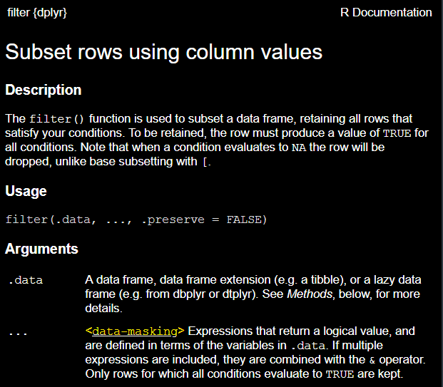

class: inverse, center, middle
# Writing tidyverse-style functions

---

# Attempt #1: Writing a tiyverse-style function

```{r, eval=FALSE}
# outside of a function, this code works
gtsummary::trial %>% 
  select(trt)
# A tibble: 200 x 1
#   trt   
#   <chr> 
# 1 Drug A
# 2 Drug B
# etc.
```

```{r, eval = FALSE}
# putting the exact (working) code into a function
test_function <- function(select_var){
  gtsummary::trial %>% 
    select(select_var)
}

# Error: object 'trt' not found
test_function(select_var = trt)
```

* Why does this error occur? Because the `{tidyverse}` utilizes *tidy evaluation*

---

# What is tidy evaluation?

**Tidy evaluation:** A framework for controlling how expressions and variables
in your code are evaluated by tidyverse functions.

* Allows programmers to select variables based on their position, name, or type

* Useful for passing variable names as inputs to functions
that use tidyverse packages like `dplyr` and `ggplot2`

* {dplyr} verbs rely on tidy evaluation to resolve programming commands

---

# Tidy evaluation

* Two types of tidy evaluation:
  
  - **Data-masking**, used by: `arrange()`, `count()`, `filter()`, `group_by()`, `mutate()`, and `summarise()`
  
  - **Tidy-select**, used by: `across()`, `relocate()`, `rename()`, `select()`, and `pull()`
  
* To determine which type of tidy evaluation a function uses, look at the help file

<!-- <p align="center"></p> -->


---

class: inverse, center, middle
# data-masking

---

# Data-masking

.pull-left[
* Data-masking is a distinctive feature of R whereby programming is performed directly on a data set, with columns defined as normal objects.
]

.pull-right[
* While data-masking makes it easy to program interactively with data frames, it makes it harder to create functions.
]

```{r, eval = FALSE}
# Almost all base R functions use unmasked programming
mean(mtcars$cyl + mtcars$am)
#> [1] 6.59375

# Referring to columns without `$` is an error - Where is the data?
mean(cyl + am)
#> Error in mean(cyl + am): object 'cyl' not found
# R is looking in the global environment for an object named 'cyl'

# Equivalent code with functions from dplyr that use data masking
# Data masking allows you to reference columns without using $
mtcars %>% 
  summarize(new_mean = mean(cyl + am))
#> new_mean
#> dbl
#> 6.59375
```

---

# Writing functions using {dplyr} verbs that use data-masking

* Data masking introduces ambiguity with respect to what you mean by "variable". 

* **env-variables**: objects (variables) that live in the environment; 
usually created with `<-`

```{r}
# example of an env-variable
x <- 3
```

* **data-variables**: variables that live in the data frame;
usually arise from reading in data or manipulating data that was read in to 
create new variables in a data frame

```{r, eval=FALSE}
# example of a data variable: mpg on df mtcars (and mtcars is an env-variable!)
mtcars$mpg
```

* Relation to data masking: Data masking allows you to reference `data-variables`
without specifying the `env-variable` they arise from. Allows for shorthand in
code, but introduces problems when writing functions.

---

# Writing functions using {dplyr} verbs that use data-masking

* {dplyr} verbs that use data masking:

  - `arrange()`, `count()`, `filter()`, `group_by()`, `mutate()`, and `summarise()`
  
*  Data masking introduces ambiguity with respect to what you mean by "variable". 
  
*  Ambiguity is clarified by indicating to R where to look for an object (within a data frame or within the environment) via `.data$varname`, `.data[[group_var]]`, `.env$global_var_name`

---

# Passing quoted arguments to group_by()

A first attempt:
  
```{r, eval=FALSE}
my_group_function <- function(group_vars){
  gtsummary::trial %>% 
    dplyr::group_by(group_vars) %>% 
    dplyr::summarize(n = n())
}

my_group_function(group_vars = "trt")
#  Error: Must group by variables found in `.data`.
# * Column `group_vars` is not found.
```

---
  
# Passing quoted arguments to group_by()
  
* Passing a single variable to group by

```{r, eval=FALSE}
my_group_function <- function(group_var){
  gtsummary::trial %>% 
    dplyr::group_by(.data[[group_var]])
}

my_group_function(group_var = "trt")
# A tibble: 200 x 8
# Groups:   trt [2]
#   trt      age marker stage grade response death ttdeath
#   <chr>  <dbl>  <dbl> <fct> <fct>    <int> <int>   <dbl>
# 1 Drug A    23  0.16  T1    II           0     0    24  
# 2 Drug B     9  1.11  T2    I            1     0    24 
```

---
  
# Passing quoted arguments to group_by()
  
* Passing multiple variables to group by 

* `across()`: allows you to use `select()` semantics inside data-masking
functions

```{r, eval=FALSE}
my_group_function <- function(group_vars){
  gtsummary::trial %>% 
    dplyr::group_by(across(group_vars))
}

my_group_function(group_vars = c("trt", "stage"))
# A tibble: 200 x 8
# Groups:   trt, stage [8]
#   trt      age marker stage grade response death ttdeath
#   <chr>  <dbl>  <dbl> <fct> <fct>    <int> <int>   <dbl>
# 1 Drug A    23  0.16  T1    II           0     0    24  
# 2 Drug B     9  1.11  T2    I            1     0    24  
```

---
  
# Passing quoted arguments to filter()
  
  A first attempt:
  
```{r, eval = FALSE}
# using a function to select a single variable
my_filter_function <- function(filter_condition){
  gtsummary::trial %>% 
    dplyr::filter(filter_condition)
}

my_filter_function(filter_condition = "age > 65")
# Error: Problem with `filter()` input `..1`.
# i Input `..1` is `filter_condition`.
# x Input `..1` must be a logical vector, not a character.
```

Why did we get this note? *The character condition needs to be an expression*
  
---
  
# Passing quoted arguments to filter()
  
* Can use `!!` injector & `rlang::parse_expr()`

* `rlang::parse_expr`: transforms text into an un-evaluated expression 
(i.e., it removes the quotation marks but doesn't evaluate the text)

* `!!` to be covered in next section

```{r, eval = FALSE}
my_filter_function <- function(filter_condition){
  gtsummary::trial %>% 
    dplyr::filter(!!rlang::parse_expr(filter_condition))
}

my_filter_function(filter_condition = "age > 65")

# A tibble: 23 x 8
#   trt      age marker stage grade response death ttdeath
#   <chr>  <dbl>  <dbl> <fct> <fct>    <int> <int>   <dbl>
# 1 Drug B    71  0.445 T4    III          0     1    8.71
# 2 Drug B    67  1.16  T1    II           0     0   24   
# 3 Drug B    68  0.105 T4    II           0     1   15.4 
# etc.
```

---

# Passing quoted arguments to mutate()

A first attempt: 

```{r, eval=FALSE}
my_mutate_function <- function(mutate_var){
  gtsummary::trial %>% 
    dplyr::mutate(mean = mean(mutate_var, na.rm = TRUE))
}

my_mutate_function(mutate_var = "age")
# mean column entirely missing
# A tibble: 200 x 9
#   trt      age marker stage grade response death ttdeath  mean
#   <chr>  <dbl>  <dbl> <fct> <fct>    <int> <int>   <dbl> <dbl>
# 1 Drug A    23  0.16  T1    II           0     0    24      NA
# 2 Drug B     9  1.11  T2    I            1     0    24      NA
# 3 Drug A    31  0.277 T1    II           0     0    24      NA
# etc.

# Warning message:
# Problem with `mutate()` column `mean`.
# i `mean = mean(mutate_var, na.rm = TRUE)`.
```

---

# Passing quoted arguments to mutate()

```{r, eval=FALSE}
my_mutate_function <- function(mutate_var){
  gtsummary::trial %>% 
    dplyr::mutate(mean = mean(.data[[mutate_var]], na.rm = TRUE))
}

my_mutate_function(mutate_var = "age")

# A tibble: 200 x 9
#   trt      age marker stage grade response death ttdeath  mean
#   <chr>  <dbl>  <dbl> <fct> <fct>    <int> <int>   <dbl> <dbl>
# 1 Drug A    23  0.16  T1    II           0     0    24    47.2
# 2 Drug B     9  1.11  T2    I            1     0    24    47.2
```

---

# Passing unquoted arguments to Data-Masking Functions

* Passing data-masked arguments to functions requires injection (also known as quasiquotation) with the embracing operator `{{ · }}` or, in more complex cases, the injection operator `!!`.

* This is needed because under the hood data-masking works by defusing R code to prevent its immediate evaluation.

* The defused code is resumed later on in a context where data frame columns are defined.

```{r, eval = FALSE}
my_mean <- function(data, var1, var2) {
  dplyr::summarise(data, mean(var1 + var2))
}

my_mean(mtcars, cyl, am)
#> Error in `dplyr::summarise()`:
#> ! Problem while computing `..1 = mean(var1 + var2)`.
#> Caused by error in `mean()`:
#> ! object 'cyl' not found
```

???

- The problem here is that `summarise()` defuses the R code it was supplied, i.e. mean(var1 + var2). 

- Instead we want it to see mean(cyl + am). 

- This is why we need injection, we need to modify that piece of code by injecting the code supplied to the function in place of var1 and var2.

---
# How to use `{{ · }}`?

* To inject a function argument in data-masked context, just embrace it with `{{ · }}`

```{r, eval = FALSE}
my_mean <- function(data, var1, var2) {
  dplyr::summarise(data, mean({{ var1 }} + {{ var2 }}))
}

my_mean(mtcars, cyl, am)
#> # A tibble: 1 x 1
#>   `mean(cyl + am)`
#>              <dbl>
#> 1             6.59
```


---

class: inverse, center, middle

# dplyr verbs that use tidy-select

---

# Writing functions using {dplyr} verbs that use tidy-select

* Details of tidy-select available [online](https://tidyselect.r-lib.org/articles/syntax.html) for the curious programmer

* Slides reflect {tidyselect} 1.2.0, released October 2022

* To write functions using {dplyr} verbs that use tidy-select: In selecting functions, can put the variable name in quotes or use `all_of()`, `any_of()` helper functions to select variables

---

# Writing functions using {dplyr} verbs that use tidy-select

* `any_of()`: selecting **any** of the listed variables

* `all_of()`: for **strict** selection. If any of the variables in the character vector is missing, an error is thrown

* Can also use `!all_of()` to select all variables not found in the character vector supplied to `all_of()`

```{r, eval = FALSE}
# using a function to select multiple variables
my_select_function <- function(select_variable){
  gtsummary::trial %>% 
    dplyr::select(dplyr::all_of(select_variable))
}

my_select_function(select_variable = c("trt", "age"))
# A tibble: 200 x 2
#   trt      age
#   <chr>  <dbl>
# 1 Drug A    23
# 2 Drug B     9
# etc.
```

---

# Passing quoted arguments to select() 

First attempt:

```{r, eval = FALSE}
# using a function to select a single variable
my_select_function <- function(select_variables){
  gtsummary::trial %>% 
    dplyr::select(select_variables)
}

my_select_function(select_variables = c("trt", "age"))
# Warning message:
# Using an external vector in selections was deprecated in tidyselect 1.1.0.
# i Please use `all_of()` or `any_of()` instead.
#   # Was:
#   data %>% select(select_variables)
# 
#   # Now:
#   data %>% select(all_of(select_variables))
# 
# See <https://tidyselect.r-lib.org/reference/faq-external-vector.html>.
```

---

# Passing quoted arguments to select() 

* No messages or warnings returned after `all_of` is added to `select`

```{r, eval = FALSE}
# using a function to select a single variable
my_select_function <- function(select_variables){
  gtsummary::trial %>% 
    dplyr::select(all_of(select_variables))
}

my_select_function(select_variables = c("trt", "age"))
# # A tibble: 200 x 1
#   trt
#   <chr>
# 1 Drug A
# 2 Drug B
# 3 Drug A
# etc.
```

---

# Passing unquoted arguments to dplyr verbs that use tidy-select

First attempt:

```{r, eval = FALSE}
# using a function to select a single variable
my_select_function <- function(select_variable){
  gtsummary::trial %>% 
    dplyr::select(select_variable)
}

my_select_function(select_variable = trt)
# Error: object 'trt' not found
```

---

# Passing unquoted arguments to dplyr verbs that use tidy-select

* Similar to with data-masking functions, `{{ }}` ("curly-curly") allows us to pass unquoted arguments to dplyr verbs

```{r, eval = FALSE}
# using a function to select a single variable
my_select_function <- function(select_variable){
  gtsummary::trial %>% 
    dplyr::select({{select_variable}})
}

my_select_function(select_variable = trt)
# Error: object 'trt' not found
```

See <https://tidyselect.r-lib.org/reference/faq-external-vector.html>.

---

# Passing quoted arguments to select()

We need to account for `select()` using tidyselect that by using `any_of()` or `all_of()`

```{r, eval=FALSE}
my_select_function <- function(select_variable){
  gtsummary::trial %>% 
    dplyr::select(all_of(select_variable))
}

my_select_function(select_variable = "trt")
# A tibble: 200 x 1
#   trt   
#   <chr> 
# 1 Drug A
# 2 Drug B
# etc.
```

---

class: inverse, center, middle

# Questions?